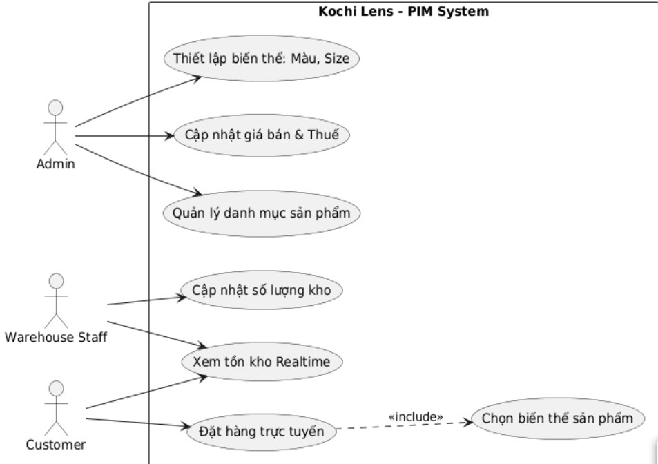
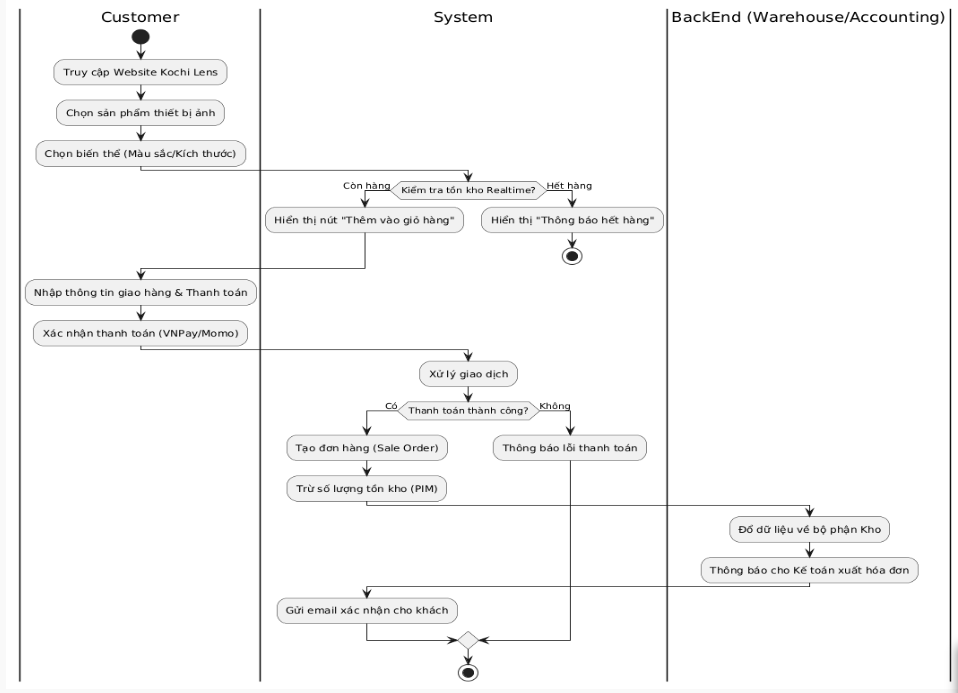

Phần 1: Mô hình hóa quy trình (Business Flow)
1.1. Sơ đồ Use Case

1.2. Sơ đồ Activity: Luồng đặt hàng

Phần 2: Đặc tả chức năng (Functional Requirements)
Yêu cầu được viết dưới dạng User Stories để tập trung vào giá trị người dùng:

US01 (Quản lý Biến thể): "Là một Admin, tôi muốn tạo các thuộc tính sản phẩm (như tiêu cự, ngàm ống kính, màu sắc) để khách hàng có nhiều lựa chọn chính xác cho nhu cầu thiết bị ảnh của họ."

US02 (Tồn kho Realtime): "Là một khách hàng, tôi muốn thấy số lượng hàng còn lại trong kho được cập nhật ngay lập tức khi tôi chọn biến thể, để tôi không đặt nhầm những mặt hàng đã hết."

US03 (Đồng bộ kho): "Là một nhân viên kho, tôi muốn hệ thống tự động trừ số lượng tồn kho ngay khi có đơn hàng thanh toán thành công để tránh tình trạng bán quá số lượng thực tế (overselling)."

US04 (Phân loại B2B/B2C): "Là một khách hàng doanh nghiệp (B2B), tôi muốn thấy bảng giá chiết khấu riêng khi đăng nhập để thực hiện mua sắm theo chính sách đại lý của Kochi Lens."
Gemini đã nói
Chào bạn, đây là bản đặc tả yêu cầu phần mềm (SRS) tập trung vào chức năng [2.1] Quản lý Sản phẩm (PIM) cho dự án Kochi Lens, được thiết kế theo cấu trúc bạn yêu cầu.

Phần 1: Mô hình hóa quy trình (Business Flow)
1.1. Sơ đồ Use Case
Sơ đồ này xác định các tác nhân chính và các hành vi tương tác với hệ thống PIM và đặt hàng.

Admin (Quản trị viên): Quản lý danh mục, thiết lập thuộc tính sản phẩm (biến thể), điều chỉnh giá.

Warehouse Staff (Nhân viên kho): Cập nhật số lượng tồn kho, kiểm kê hàng hóa.

Customer (Khách hàng): Xem sản phẩm, chọn biến thể, kiểm tra tình trạng còn hàng.

1.2. Sơ đồ Activity: Luồng đặt hàng và Xử lý tồn kho
Luồng này mô tả từ khi khách hàng chọn sản phẩm (có kiểm tra biến thể) đến khi thanh toán thành công.

Khách hàng: Truy cập danh mục → Chọn sản phẩm → Chọn biến thể (ví dụ: Lens 35mm, Màu Đen).

Hệ thống: Kiểm tra tồn kho realtime của biến thể đó.

Khách hàng: Thêm vào giỏ hàng → Nhập thông tin thanh toán.

Cổng thanh toán: Xử lý giao dịch (VNPay/Momo).

Hệ thống: Nếu thành công, trừ tồn kho (Reserved) và chuyển trạng thái đơn hàng sang Sale Order.

Phần 2: Đặc tả chức năng (Functional Requirements)
Yêu cầu được viết dưới dạng User Stories để tập trung vào giá trị người dùng:

US01 (Quản lý Biến thể): "Là một Admin, tôi muốn tạo các thuộc tính sản phẩm (như tiêu cự, ngàm ống kính, màu sắc) để khách hàng có nhiều lựa chọn chính xác cho nhu cầu thiết bị ảnh của họ."

US02 (Tồn kho Realtime): "Là một khách hàng, tôi muốn thấy số lượng hàng còn lại trong kho được cập nhật ngay lập tức khi tôi chọn biến thể, để tôi không đặt nhầm những mặt hàng đã hết."

US03 (Đồng bộ kho): "Là một nhân viên kho, tôi muốn hệ thống tự động trừ số lượng tồn kho ngay khi có đơn hàng thanh toán thành công để tránh tình trạng bán quá số lượng thực tế (overselling)."

US04 (Phân loại B2B/B2C): "Là một khách hàng doanh nghiệp (B2B), tôi muốn thấy bảng giá chiết khấu riêng khi đăng nhập để thực hiện mua sắm theo chính sách đại lý của Kochi Lens."

Phần 3: Đặc tả dữ liệu (Data Schema)
Để hệ thống vận hành trơn tru, các bảng dữ liệu cần đảm bảo các trường thông tin sau:

3.1. Partner (Khách hàng/Đối tác)
Trường dữ liệu Kiểu dữ liệu Ghi chú
Partner_ID String (PK) Mã khách hàng duy nhất
Partner_Name String Tên cá nhân hoặc Tên công ty
Tax_Code String Mã số thuế (Bắt buộc nếu là B2B)
Partner_Type Enum Guest, B2C, B2B
Shipping_Address Text Địa chỉ giao hàng mặc định
Email String Dùng để gửi Invoice và xác nhận đơn
3.2. Product (Sản phẩm & Biến thể)
Trường dữ liệu Kiểu dữ liệu Ghi chú
Product_ID String (PK) Mã sản phẩm cha
SKU String (Unique) Mã định danh từng biến thể (ví dụ: LENS-35-BLK)
Barcode String Mã vạch để quét kho
Variant_Attributes JSON Lưu màu sắc, kích thước, ngàm...
Base_Price Decimal Giá bán chưa thuế
VAT_Rate Decimal Thuế suất (ví dụ: 10%)
Stock_Quantity Integer Số lượng tồn kho thực tế
3.3. Order (Đơn hàng)
Trường dữ liệu Kiểu dữ liệu Ghi chú
Order_ID String (PK) Số đơn hàng (VD: ORD-2024-001)
Customer_ID String (FK) Liên kết với bảng Partner
Total_Amount Decimal Tổng giá trị sau thuế và phí ship
Order_Status Enum Draft, Confirmed, Processing, Done, Cancelled
Payment_Status Boolean Đã thanh toán / Chưa thanh toán
